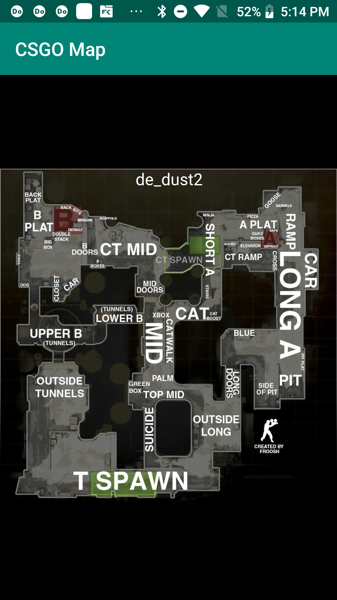

# CSGO Map

This project is built for CSGO player (including me... XD) that unfamiliar with CSGO competitive map. While play CSGO competitive, I often forget what it ll call in that place, so I made this app for myself. (it can help me when I play CSGO hehe...) The entire project is written by kotlin.

## Screenshot

## Release

* [v0.1-alpha](https://github.com/tonyyang924/CSGOMap/releases/download/v0.1-alpha/app-debug.apk)

## Functionality

implemented:

* map zoom in [v]
* map zoom out [v]

Not yet:

* mark point [x]

## Contributing

* Fork this project
* Create feature branch: `git checkout -b my-feature-branch`
* Commit your change
* Push to the branch: `git push origin my-feature-branch`
* Submit a pull request

## Author

* **Tony Yang** - initial & develop basic feature - [tonyyang924](https://github.com/tonyyang924)

## Reference

[CS:GO All Map Callouts - Overviews for Competitive Maps 2018](https://www.tobyscs.com/csgo-map-callout-overviews)

## License

This project is licensed under the MIT License - see the [LICENSE](LICENSE) file for details